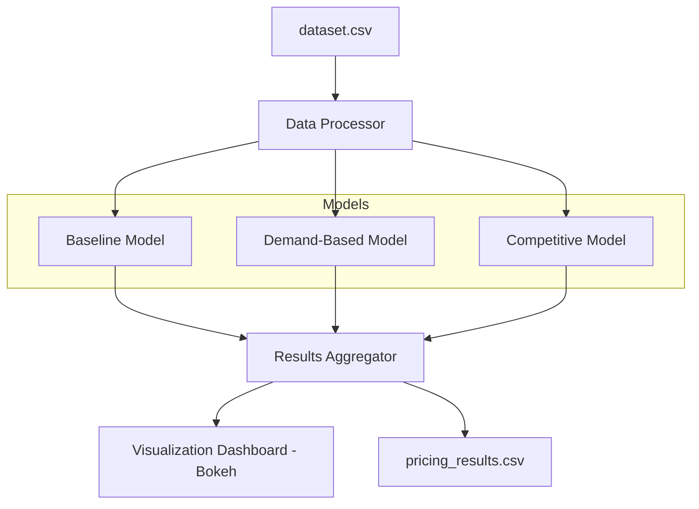

# Dynamic Parking Pricing System

A real-time, data-driven solution for optimizing urban parking lot prices using Python, Pandas, Numpy, Pathway, and Bokeh. This project simulates and visualizes dynamic pricing strategies to maximize utilization and revenue for city parking spaces.

---

## 🚗 Project Overview

Urban parking is a complex, dynamic problem. This system ingests real-time parking data, applies three progressive pricing models, and visualizes the results. It is designed to help city planners and parking operators make smarter, data-backed decisions for pricing and congestion management.

---

## 🛠️ Tech Stack

- **Python 3.8+** — Core programming language  
- **Pandas** — Data manipulation and preprocessing  
- **Numpy** — Numerical operations  
- **Pathway** — Real-time/streaming data simulation  
- **Bokeh** — Interactive data visualization  
- **(Optional) Mermaid** — For architecture diagrams in markdown  

---

## 🏗️ Architecture Diagram

## Features

- **Three Pricing Models:**  
  1. **Baseline:** Adjusts price based on occupancy  
  2. **Demand-Based:** Considers occupancy, queue, traffic, special days, vehicle type  
  3. **Competitive:** Adds location and competitor price awareness

- **Real-Time Simulation:**  
  Processes your parking data as a stream, just like live sensors.

- **Interactive Dashboard:**  
  Visualizes prices, occupancy, and model comparisons with Bokeh.

- **Plug-and-Play Data:**  
  Works with standard parking datasets (see below for columns).

## How to Use

1. **Install dependencies:**

2. **Add your data:**  
Place your dataset as `dataset.csv` in the project folder.  
Required columns (any naming, auto-mapped):  
- ID, Capacity, Latitude, Longitude, Occupancy, VehicleType, TrafficConditionNearby, QueueLength, IsSpecialDay, LastUpdatedDate, LastUpdatedTime

3. **Run the system:**
- Follow prompts to run simulation and view dashboards in your browser.

## What You'll See

- **Price trends** for each model over time
- **Space-by-space comparisons**
- **Occupancy vs. price analysis**
- **Summary stats** and easy model comparison

## Customization

- Change pricing logic or parameters in the `models/` files.
- Adjust sample size or base price in `main.py`.

## Why Use This?

- **No ML black boxes:** All pricing logic is transparent and adjustable.
- **Ready for real-world data:** Handles common parking dataset formats.
- **Instant insights:** See the impact of pricing strategies before deploying.

---

